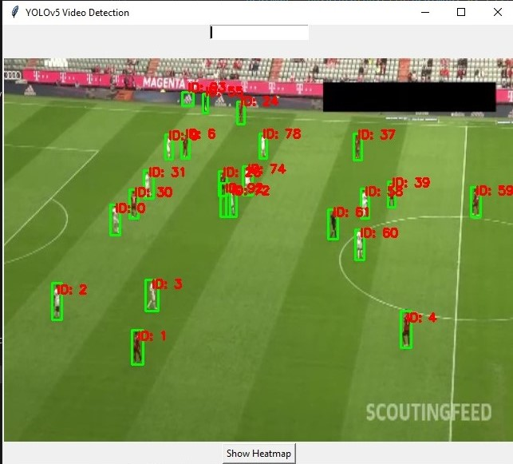

# YOLOv5 Player Tracking and Heatmap Visualization

This project utilizes YOLOv5, a state-of-the-art object detection model, to track players in a football game and generate a heatmap to visualize the movements of a specific player. The application is implemented using Python and Tkinter for an interactive GUI, and OpenCV for video processing and visualization.

---

## Features

### Player Detection and Tracking:
- Automatically detects and tracks players in a football video using YOLOv5.
- Assigns a unique ID to each player based on spatial proximity.



### Player Movement Heatmap:
- Generates a heatmap for a selected player based on their positions during the game.
- Superimposes the heatmap on a football field image for better visualization.
- Dynamically updates the heatmap as the video progresses.


### Interactive GUI:
- User-friendly Tkinter-based interface.
- Allows the user to input the ID of a player to visualize their movements.

---

## Prerequisites

Ensure the following dependencies are installed before running the application:

### Required Software:
- **Python**: Version 3.7 or later

### Required Libraries:
- `opencv-python`
- `torch`
- `Pillow`
- `matplotlib`
- `numpy`

To install the dependencies, run:

```bash
pip install opencv-python torch Pillow matplotlib numpy
```

### YOLOv5 Model:
The application uses the `yolov5s` model from the Ultralytics YOLOv5 repository.

---

## Getting Started

### Clone the Repository

```bash
git clone https://github.com/engyelsarta/Yolov5_Player_tracking.git
cd Yolov5_Player_tracking
```

### Prepare Video and Field Image

#### Video:
- Place your video file in the project directory or provide its path in the `video_path` variable in the code.

#### Field Image:
- Use an empty football field image as the background for the heatmap.
- Update the `field_image_path` variable in the code with the path to this image.

---

## How to Run the Application

1. Open a terminal and navigate to the project directory.
2. Run the script:

```bash
Yolo.py
```

### Application Features:
- **Video Display**: The application displays the video frames with detected players and their IDs.
- **Player Selection**: Input the ID of the player you want to track.
- **Heatmap Generation**: Press the "Show Heatmap" button to generate a heatmap for the selected player.

---

## How It Works

### Player Detection:
- The YOLOv5 model detects players in each frame of the video.
- Bounding boxes and unique IDs are displayed on the video.

### Player Selection:
- Enter a player's ID in the input box and press the "Show Heatmap" button.

### Heatmap Visualization:
- A heatmap window displays the movement pattern of the selected player.
- The heatmap is dynamically updated as the video progresses.

### Tracking Algorithm:
- Tracks players by comparing their positions frame by frame.
- Assigns new IDs for newly detected players.

---

## Customization

### Threshold Distance:
- Adjust the `threshold_distance` variable to change the minimum distance for considering a player the same across frames. This improves accuracy for different videos.

### Heatmap Intensity:
- Modify the `cv2.GaussianBlur` kernel size and circle size in the `update_heatmap` function to adjust heatmap smoothness and intensity.

### Performance:
- Resize the video frame in the `update_frame` function for faster processing.

---

## Known Issues

1. Tracking accuracy might vary in videos with overlapping players or poor video quality.
2. Heatmap visualization may not align perfectly with the field image if the field perspective in the video differs significantly.

---

## License

This project is licensed under the MIT License. See the LICENSE file for more details.

---

## Acknowledgments

- **Ultralytics YOLOv5**: For the powerful object detection framework.
- **OpenCV**: For image and video processing.
- **Python's Tkinter library**: For creating an interactive GUI.
